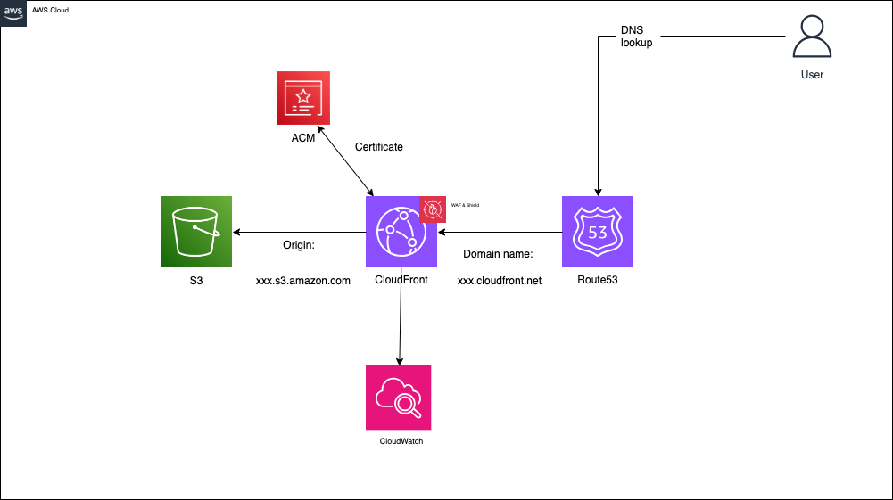

As part of website infrastructure refactor, infrastructure was created and is hosted on AWS.

## Requires
- Terraform (https://www.terraform.io/)
- Terragrunt (https://terragrunt.gruntwork.io/)

## How is this repository structured?

The Terraform code contained in `aws` is split into several independent modules that all use their own remote Terraform state file. These modules know nothing about Terragrunt and are used by Terragrunt as simple infrastructure definitions.

The directory structure inside `aws` reflects the split into independent modules. For example, `ecr`, contains the lifecycle policy and configuration that creates the ECR that will be used by the `app (lambda)` module.

At the moment, there is only a production environment in the `env` which contains the Terragrunt scripts.

## What is each Terraform module

### [`aws/cloudfront`](terragrunt/aws/cloudfront)
Contains:
- Certificates: used to request a DNS validated certificate, deploy the required validation records and wait for validation to complete.
- Cloudfront: creates a Cloudfront web distribution and contains HTTP response headers and their values.
- IAM
- S3: holds access logs
- WAF: WAFv2 Web ACL resource

### [`aws/ecr`](terragrunt/aws/ecr)
Contains the Elastic Container Registry (ECR) Repository, that will hold the docker image for the staging link

### [`aws/hosted_zone`](terragrunt/aws/hosted_zone)
Manages Route53 Hosted Zone

### [`aws/s3`](terragrunt/aws/s3)
Contains the English and French buckets that hold all the website content

## Architectural Decision Record (ADR)
Simply hosting a static website using S3, Cloudfront and Route53. Using this set up is an easy, cost-effective and secure way to deploy a static website. Website content is simply pushed through a GitHub workflow into the respective English or French buckets, after everycontent change, Cloudfront invalidates the cache and using Route53 to route traffic to the CloudFront distribution serving the website contents.

There is also infrastructure set up for the staging environment, which uses a Docker image based AWS Lambda function to run the app, accessed using a Lambda Function url.

